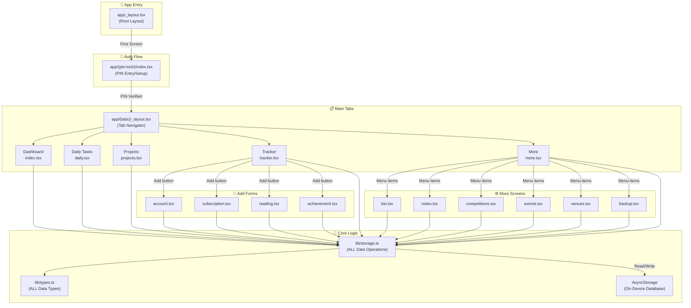

# MyLife Manager — Complete Codebase Analysis

> A comprehensive guide to every file, how they connect, and how to build and run this app.

---

## 1. What Is This App?

**MyLife Manager** is a **personal life management mobile app** built with **React Native + Expo**. It's designed as an all-in-one tool to manage:

- 🔑 **Account credentials** (passwords, logins)
- 💰 **Subscriptions** (Netflix, Spotify, with cost tracking)
- 📋 **Daily to-do tasks** (with carry-over from yesterday)
- 📁 **Projects** (with service-account mapping: which Google account for which cloud service)
- 📖 **Reading tracker** (books, research papers, articles)
- 🏆 **Achievements** (hackathon wins, awards, certifications)
- 🏅 **Competitions** (upcoming/past events & results)
- 📅 **Events** (meetings, deadlines, hackathons)
- 📍 **Venues** (locations)
- 📝 **Notes** (categorized quick notes)
- 👤 **Bio data** (personal profile info)
- 🔐 **PIN lock** (6-digit PIN security on app launch)
- 💾 **Backup/Restore** (export/import all data as JSON)

> [!IMPORTANT]
> All data is stored **locally on the device** using AsyncStorage. There is **no cloud sync** — the server backend exists only for Manus OAuth authentication, which this app doesn't actively use for its core features.

---

## 2. Technology Stack (Explained for Beginners)

| Technology | What It Is | Role in This App |
|---|---|---|
| **React Native** | Framework for building mobile apps using JavaScript/React | The core framework — writes iOS/Android apps in one codebase |
| **Expo** (v54) | A toolkit on top of React Native that simplifies building/running | Handles app building, icons, splash screens, and dev tools |
| **Expo Router** (v6) | File-based routing for React Native (like Next.js but for mobile) | Each file in `app/` becomes a screen/route automatically |
| **TypeScript** | JavaScript with type annotations | Prevents bugs by catching type errors at compile time |
| **NativeWind** (v4) | Tailwind CSS for React Native | Lets you write `className="px-5 bg-white"` in mobile components |
| **Tailwind CSS** (v3) | Utility-first CSS framework | Provides the design utility classes |
| **AsyncStorage** | Key-value storage on the device | Stores ALL app data locally (accounts, tasks, settings, etc.) |
| **tRPC** | Type-safe API framework | Connects client to server with full TypeScript types |
| **Express** | Node.js web server | Backend server for OAuth authentication |
| **Drizzle ORM** | TypeScript database ORM | Manages MySQL database schema (for auth users table) |
| **React Query** (TanStack) | Server state management | Caches and manages API call results |
| **pnpm** | Fast package manager (like npm) | Installs all dependencies |

---

## 3. How to Build & Run the App

### Prerequisites You Need to Install

1. **Node.js** (v18+): [nodejs.org](https://nodejs.org)
2. **pnpm** (v9.12): `npm install -g pnpm@9.12.0`
3. **Expo Go app** on your phone: Download from App Store / Google Play

### Step-by-Step Setup

```bash
# 1. Navigate to the project
cd "c:\Users\sithu\MyWorks\My Softwares\Mobile_Apps\my_life_manager"

# 2. Install all dependencies
pnpm install

# 3. Start the development server (Metro bundler only — no backend needed)
pnpm dev:metro
# OR for Android specifically:
pnpm android
# OR for iOS:
pnpm ios
```

### Connecting Your Phone

When `pnpm dev:metro` runs, it starts **Metro** (the JavaScript bundler) on port 8081. You'll see a QR code in the terminal.

1. Open **Expo Go** on your phone
2. Scan the QR code
3. The app loads on your phone!

> [!WARNING]
> Your phone and computer must be on the **same WiFi network**. If the QR code doesn't work, try pressing `s` in the terminal to switch to tunnel mode (requires `@expo/ngrok`).

### The `pnpm dev` Command

The full `pnpm dev` command runs **two processes** concurrently:
- `dev:server`: Starts the Express backend server on port 3000 (for OAuth)
- `dev:metro`: Starts the Expo/Metro bundler on port 8081 (for the app)

**For your use case, you only need `pnpm dev:metro`** — the server is only needed for Manus OAuth which you're not using.

### Building a Standalone APK/IPA

To create an actual installable app (not through Expo Go):

```bash
# Generate the native Android project
npx expo prebuild --platform android

# Build the APK
cd android && ./gradlew assembleRelease

# OR use Expo's cloud build service (EAS Build)
npx eas-cli build --platform android
```

> [!NOTE]
> `expo prebuild` generates native `android/` and `ios/` folders (currently git-ignored). You need Android Studio for Android builds and Xcode (Mac only) for iOS builds.

---

## 4. Complete Directory Structure

```
my_life_manager/
├── app/                          # 🖥️ ALL SCREENS (file-based routing)
│   ├── _layout.tsx               #    Root layout (providers, navigation)
│   ├── (pin-lock)/               #    PIN lock screen group
│   │   ├── _layout.tsx           #    Stack navigator wrapper
│   │   └── index.tsx             #    PIN entry/setup screen
│   ├── (tabs)/                   #    Main tab bar screens
│   │   ├── _layout.tsx           #    Tab bar configuration
│   │   ├── index.tsx             #    Dashboard/Home screen
│   │   ├── daily.tsx             #    Daily tasks screen
│   │   ├── projects.tsx          #    Projects screen
│   │   ├── tracker.tsx           #    Tracker (accounts/subs/reading/achievements)
│   │   └── more.tsx              #    More screen (settings hub)
│   ├── (add)/                    #    Add-item form screens
│   │   ├── _layout.tsx           #    Stack navigator wrapper
│   │   ├── account.tsx           #    Add account form
│   │   ├── subscription.tsx      #    Add subscription form
│   │   ├── reading.tsx           #    Add reading item form
│   │   └── achievement.tsx       #    Add achievement form
│   ├── (more)/                   #    More sub-screens
│   │   ├── _layout.tsx           #    Stack navigator wrapper
│   │   ├── bio.tsx               #    Bio data editor
│   │   ├── notes.tsx             #    Notes manager
│   │   ├── competitions.tsx      #    Competitions manager
│   │   ├── events.tsx            #    Events manager
│   │   ├── venues.tsx            #    Venues manager
│   │   └── backup.tsx            #    Backup & restore screen
│   ├── oauth/
│   │   └── callback.tsx          #    OAuth callback handler (Manus auth)
│   └── dev/
│       └── theme-lab.tsx         #    Developer theme testing screen
│
├── components/                   # 🧩 REUSABLE UI COMPONENTS
│   ├── screen-container.tsx      #    SafeArea + background wrapper
│   ├── haptic-tab.tsx            #    Tab button with haptic feedback
│   ├── themed-view.tsx           #    Theme-aware View wrapper
│   ├── hello-wave.tsx            #    Animated wave emoji (unused)
│   ├── parallax-scroll-view.tsx  #    Parallax header scroll (unused)
│   ├── external-link.tsx         #    Web link opener
│   └── ui/
│       ├── icon-symbol.tsx       #    Icon component (SF Symbols → Material Icons)
│       ├── icon-symbol.ios.tsx   #    iOS-specific native SF Symbols
│       └── collapsible.tsx       #    Collapsible/accordion component
│
├── lib/                          # 📚 CORE BUSINESS LOGIC
│   ├── storage.ts                #    ⭐ ALL data operations (CRUD for every module)
│   ├── types.ts                  #    ⭐ ALL TypeScript interfaces/types
│   ├── trpc.ts                   #    tRPC client setup
│   ├── utils.ts                  #    Tailwind class merger utility
│   ├── theme-provider.tsx        #    Theme context provider (light/dark)
│   └── _core/                    #    Internal framework code
│       ├── api.ts                #    HTTP API client (for OAuth)
│       ├── auth.ts               #    Auth token management
│       ├── manus-runtime.ts      #    Manus iframe communication
│       ├── theme.ts              #    Theme color system
│       └── nativewind-pressable.ts #  NativeWind Pressable fix
│
├── hooks/                        # 🪝 REACT HOOKS
│   ├── use-auth.ts               #    Authentication state hook
│   ├── use-colors.ts             #    Current theme colors hook
│   ├── use-color-scheme.ts       #    Device color scheme hook (native)
│   └── use-color-scheme.web.ts   #    Device color scheme hook (web)
│
├── constants/                    # 📌 APP CONSTANTS
│   ├── oauth.ts                  #    OAuth URLs, keys, login flow
│   ├── theme.ts                  #    Re-exports from lib/_core/theme
│   └── const.ts                  #    Cookie names, timeouts, error messages
│
├── server/                       # 🖧 BACKEND SERVER (Express)
│   ├── routers.ts                #    tRPC API routes definition
│   ├── db.ts                     #    Database operations (Drizzle)
│   ├── storage.ts                #    S3 storage helpers (Manus)
│   └── _core/                    #    Server internals
│       ├── index.ts              #    Express server entry point
│       ├── trpc.ts               #    tRPC server setup
│       ├── context.ts            #    Request context (auth)
│       ├── cookies.ts            #    Cookie handling
│       ├── env.ts                #    Environment variables
│       ├── oauth.ts              #    OAuth routes
│       ├── sdk.ts                #    Manus SDK integration
│       ├── llm.ts                #    LLM API proxy
│       ├── heartbeat.ts          #    Heartbeat/health
│       ├── notification.ts       #    Push notifications
│       ├── dataApi.ts            #    Data API proxy
│       ├── imageGeneration.ts    #    Image generation proxy
│       ├── voiceTranscription.ts #    Voice transcription proxy
│       ├── storageProxy.ts       #    Storage proxy routes
│       ├── systemRouter.ts       #    System health tRPC route
│       └── types/
│           ├── manusTypes.ts     #    Manus platform types
│           └── cookie.d.ts       #    Cookie type declarations
│
├── shared/                       # 🔄 SHARED BETWEEN CLIENT & SERVER
│   ├── const.ts                  #    Cookie name constant
│   ├── types.ts                  #    Shared type definitions
│   └── _core/
│       └── errors.ts             #    Custom error classes
│
├── drizzle/                      # 🗃️ DATABASE SCHEMA & MIGRATIONS
│   ├── schema.ts                 #    Users table definition
│   ├── relations.ts              #    Table relations (empty)
│   ├── 0000_elite_eternals.sql   #    Initial migration SQL
│   ├── meta/                     #    Migration metadata
│   └── migrations/               #    Migration files
│
├── assets/images/                # 🖼️ APP IMAGES
│   ├── icon.png                  #    App icon
│   ├── splash-icon.png           #    Splash screen logo
│   ├── favicon.png               #    Web favicon
│   ├── android-icon-*.png        #    Android adaptive icons
│   └── react-logo*.png           #    Template logos (unused)
│
├── scripts/                      # 🔧 BUILD/DEV SCRIPTS
│   ├── generate_qr.mjs           #    Generate QR code for Expo URL
│   ├── load-env.js               #    Custom .env loader
│   └── reset-project.js          #    Reset to clean template
│
├── tests/                        # 🧪 TESTS
│   └── auth.logout.test.ts       #    Auth logout test
│
├── docs/                         # 📄 DOCUMENTATION (empty)
│
├── app.config.ts                 # ⚙️ EXPO CONFIGURATION
├── package.json                  # 📦 DEPENDENCIES & SCRIPTS
├── tsconfig.json                 # 📐 TYPESCRIPT CONFIG
├── babel.config.js               # 🔨 BABEL (transpiler) CONFIG
├── metro.config.js               # 🚇 METRO (bundler) CONFIG
├── tailwind.config.js            # 🎨 TAILWIND CSS CONFIG
├── theme.config.js               # 🎨 COLOR PALETTE DEFINITION
├── drizzle.config.ts             # 🗃️ DRIZZLE ORM CONFIG
├── eslint.config.js              # 🔍 LINTING CONFIG
├── global.css                    # 🌐 TAILWIND CSS IMPORTS
├── .npmrc                        # 📦 PNPM CONFIG
├── .watchmanconfig               # 👀 FILE WATCHER CONFIG
├── .gitignore                    # 🚫 GIT IGNORE RULES
├── design.md                     # 📋 UI/UX DESIGN PLAN
├── todo.md                       # ✅ PROJECT TODO LIST
└── template.json                 # 🏗️ MANUS TEMPLATE DEFINITION
```

---

## 5. How the Files Connect — Architecture Overview



### The Data Flow

1. **App starts** → [app/_layout.tsx](file:///c:/Users/sithu/MyWorks/My%20Softwares/Mobile_Apps/my_life_manager/app/_layout.tsx) loads — wraps everything in ThemeProvider, tRPC Provider, QueryClient, and SafeAreaProvider
2. **PIN Lock** → [app/(pin-lock)/index.tsx](file:///c:/Users/sithu/MyWorks/My%20Softwares/Mobile_Apps/my_life_manager/app/(pin-lock)/index.tsx) checks if a PIN exists. If first launch → create PIN. Otherwise → verify PIN.
3. **After PIN** → Navigates to `/(tabs)` — the main tab navigator
4. **Every screen** reads/writes data through [lib/storage.ts](file:///c:/Users/sithu/MyWorks/My%20Softwares/Mobile_Apps/my_life_manager/lib/storage.ts), which uses AsyncStorage under the hood
5. **All data types** are defined in [lib/types.ts](file:///c:/Users/sithu/MyWorks/My%20Softwares/Mobile_Apps/my_life_manager/lib/types.ts)

---

## 6. Detailed File Explanations

### 6.1 Root Configuration Files

#### [`app.config.ts`](file:///c:/Users/sithu/MyWorks/My%20Softwares/Mobile_Apps/my_life_manager/app.config.ts)
The **Expo configuration file** — equivalent to `AndroidManifest.xml` + `Info.plist` combined. Defines:
- App name: `"MyLife Manager"`, slug: `"mylife-manager"`
- Bundle ID: `com.app.mylifemanager` (used on App Store/Play Store)
- Icon, splash screen, orientation (portrait-only)
- Android permissions: `POST_NOTIFICATIONS`
- Deep linking scheme: `manusylifemanager`
- Plugins: expo-router, expo-audio, expo-video, expo-splash-screen, expo-build-properties

#### [`package.json`](file:///c:/Users/sithu/MyWorks/My%20Softwares/Mobile_Apps/my_life_manager/package.json)
Defines all dependencies and npm scripts:
- **`pnpm dev`** — Runs server + metro concurrently
- **`pnpm dev:metro`** — Runs just the Expo dev server (what you need)
- **`pnpm android`** / `pnpm ios` — Start on specific platform
- **`pnpm build`** — Bundles server for production
- **`pnpm db:push`** — Generate & run database migrations
- **`pnpm qr`** — Generate QR code image for Expo URL
- Package manager: **pnpm v9.12.0**

#### [`theme.config.js`](file:///c:/Users/sithu/MyWorks/My%20Softwares/Mobile_Apps/my_life_manager/theme.config.js)
The **single source of truth for all colors**. Defines 9 color tokens, each with light/dark variants:

| Token | Light | Dark | Usage |
|-------|-------|------|-------|
| `primary` | `#5B8DEF` | `#5B8DEF` | Accent buttons, active tabs |
| `background` | `#FFFFFF` | `#151718` | Screen backgrounds |
| `surface` | `#F7F8FA` | `#1e2022` | Cards, input backgrounds |
| `foreground` | `#1A1A2E` | `#ECEDEE` | Primary text |
| `muted` | `#8B8FA3` | `#9BA1A6` | Secondary text, labels |
| `border` | `#E8EAED` | `#334155` | Dividers, card borders |
| `success` | `#34D399` | `#4ADE80` | Completed, active states |
| `warning` | `#FBBF24` | `#FBBF24` | Pending, carry-over |
| `error` | `#F87171` | `#F87171` | Delete, error states |

---

### 6.2 The App Screens (app/ directory)

#### How Expo Router Works

Expo Router uses **file-based routing** — every `.tsx` file in `app/` automatically becomes a navigable screen:
- `app/(tabs)/index.tsx` → URL: `/(tabs)/`
- `app/(more)/bio.tsx` → URL: `/(more)/bio`
- Folders in parentheses `(tabs)`, `(add)`, `(more)` are **route groups** — they define navigation layouts (tabs, stacks) without affecting the URL

#### [`app/_layout.tsx`](file:///c:/Users/sithu/MyWorks/My%20Softwares/Mobile_Apps/my_life_manager/app/_layout.tsx) — Root Layout
**The most important file**. Wraps the entire app with:
1. `ThemeProvider` — provides light/dark mode
2. `SafeAreaProvider` — handles notch/status bar insets
3. `trpc.Provider` + `QueryClientProvider` — server state management
4. `GestureHandlerRootView` — enables gesture handling
5. `Stack` navigator — defines the 5 route groups: (pin-lock), (tabs), (add), (more), oauth/callback
6. Initializes **Manus runtime** for iframe communication

#### [`app/(pin-lock)/index.tsx`](file:///c:/Users/sithu/MyWorks/My%20Softwares/Mobile_Apps/my_life_manager/app/(pin-lock)/index.tsx) — PIN Lock Screen
- **First launch**: Shows "Set Your PIN" → user enters 6 digits → confirms → saves to AsyncStorage → navigates to main app
- **Subsequent launches**: Shows "Enter PIN" → user enters 6 digits → verified against stored PIN → navigates to main app
- **Wrong PIN**: Shows error, clears input
- Uses custom numpad (0-9 buttons + delete)

#### [`app/(tabs)/_layout.tsx`](file:///c:/Users/sithu/MyWorks/My%20Softwares/Mobile_Apps/my_life_manager/app/(tabs)/_layout.tsx) — Tab Bar
Defines the 5 bottom tabs:
1. **Home** (`index.tsx`) — house icon
2. **Daily** (`daily.tsx`) — list icon
3. **Projects** (`projects.tsx`) — folder icon
4. **Tracker** (`tracker.tsx`) — bar chart icon
5. **More** (`more.tsx`) — more_horiz icon

Uses `HapticTab` for tactile feedback on tab press.

#### [`app/(tabs)/index.tsx`](file:///c:/Users/sithu/MyWorks/My%20Softwares/Mobile_Apps/my_life_manager/app/(tabs)/index.tsx) — Dashboard
Shows:
- Greeting based on time of day ("Good morning/afternoon/evening")
- Current date
- Quick stats bar: Accounts count, Active subscriptions, Pending tasks
- Module cards grid (2 columns): tappable cards linking to each section

#### [`app/(tabs)/daily.tsx`](file:///c:/Users/sithu/MyWorks/My%20Softwares/Mobile_Apps/my_life_manager/app/(tabs)/daily.tsx) — Daily Tasks
- Date header with completion counter
- Quick-add task input + blue "+" button
- Task list with circular checkboxes (green when completed) + delete button
- **Day transition logic**: When opened on a new day, shows "Carry Over" modal for yesterday's unfinished tasks, and optionally shows yesterday's completion report

#### [`app/(tabs)/projects.tsx`](file:///c:/Users/sithu/MyWorks/My%20Softwares/Mobile_Apps/my_life_manager/app/(tabs)/projects.tsx) — Projects Manager
- Filter bar: All / Ongoing / Completed / On Hold / Planned
- Project cards showing: title, status badge, category, description, service count
- **Service-Account Mapping**: Each project can track which accounts (Google, GitHub) are used for which services (Supabase, AWS, Vercel, etc.)
- Add Project modal with full form
- Project detail modal showing linked services
- **ServiceAccountEditor** sub-component for linking accounts to services

#### [`app/(tabs)/tracker.tsx`](file:///c:/Users/sithu/MyWorks/My%20Softwares/Mobile_Apps/my_life_manager/app/(tabs)/tracker.tsx) — Tracker (553 lines!)
The largest screen — contains 4 sub-tabs:

1. **Accounts**: Search + category filter, show/hide passwords, copy to clipboard, inline edit modal
2. **Subscriptions**: Total monthly spend summary, status badges, cost display, inline edit
3. **Reading**: Status badges (not started/reading/completed), star ratings, inline edit
4. **Achievements**: Type badges, date/place/prize display, inline edit

Each sub-tab has its own add route (`/(add)/account`, etc.) and inline edit modals.

#### [`app/(tabs)/more.tsx`](file:///c:/Users/sithu/MyWorks/My%20Softwares/Mobile_Apps/my_life_manager/app/(tabs)/more.tsx) — More/Settings
- Bio profile preview card (shows initials avatar, name, education)
- Menu items: Bio Data, Notes, Competitions, Events, Venues, Change PIN, Backup & Restore
- **Change PIN modal**: Old PIN → New PIN → Confirm New PIN (3-step flow)

#### Add Forms (`app/(add)/`)
All 4 forms follow the same pattern:
- Back arrow + title header + Save button
- Form fields in a white rounded card
- Category/type selectors as pill buttons
- Haptic feedback on save
- Navigate back after save

#### More Screens (`app/(more)/`)
- **bio.tsx**: Full profile editor with sections (Personal, Education, Social/Professional, Notes)
- **notes.tsx**: CRUD notes with category, content, timestamps
- **competitions.tsx**: CRUD competitions with status (upcoming/ongoing/completed)
- **events.tsx**: CRUD events with type (meeting/deadline/conference/hackathon/personal)
- **venues.tsx**: CRUD venues with name, address, city
- **backup.tsx**: Export all data to JSON (copies to clipboard), import from pasted JSON

---

### 6.3 Core Logic (lib/ directory)

#### [`lib/types.ts`](file:///c:/Users/sithu/MyWorks/My%20Softwares/Mobile_Apps/my_life_manager/lib/types.ts) — All Data Types
Defines TypeScript interfaces for every data entity:

| Interface | Key Fields |
|---|---|
| `Account` | id, category, name, username, password, url, notes |
| `Subscription` | id, name, cost, currency, billingCycle, renewalDate, status |
| `BioData` | fullName, dateOfBirth, phone, email, education, github, linkedin |
| `Note` | id, title, content, category, createdAt, updatedAt |
| `Competition` | id, name, category, status, startDate, result |
| `Event` | id, title, date, type, description |
| `Venue` | id, name, address, city |
| `Task` | id, title, completed, completedAt, carriedOver |
| `DailyReport` | date, totalTasks, completedTasks, unfinishedTasks |
| `ReadingItem` | id, type, title, author, status, rating, pages, pagesRead |
| `Achievement` | id, title, type, date, place, prize, competitionId |
| `Project` | id, title, status, githubRepo, techStack, serviceAccounts |
| `ProjectServiceAccount` | service, accountEmail, accountId |
| `AppSettings` | pinSet, lastOpenDate, lastReportDate |

#### [`lib/storage.ts`](file:///c:/Users/sithu/MyWorks/My%20Softwares/Mobile_Apps/my_life_manager/lib/storage.ts) — The Data Layer
**The heart of the app**. Provides CRUD operations for every entity using AsyncStorage:

```
AsyncStorage Keys:
@mylife_accounts, @mylife_subscriptions, @mylife_bio_data,
@mylife_notes, @mylife_competitions, @mylife_events,
@mylife_venues, @mylife_tasks, @mylife_daily_reports,
@mylife_reading_items, @mylife_achievements, @mylife_projects,
@mylife_settings, @mylife_pin
```

Each module exports: `getAll()`, `getById()`, `add()`, `update()`, `delete()`
Special methods:
- `tasks.toggle(id)` — toggles task completion
- `tasks.clearCompleted()` — removes completed tasks
- `tasks.carryOver(ids)` — marks tasks as carried over from yesterday
- `pinStorage.verify(pin)` — checks PIN against stored value
- `settings.save(updates)` — merges partial settings

IDs are generated as: `Date.now().toString(36) + Math.random().toString(36).substring(2,9)`

#### [`lib/theme-provider.tsx`](file:///c:/Users/sithu/MyWorks/My%20Softwares/Mobile_Apps/my_life_manager/lib/theme-provider.tsx) — Theme System
Provides `ThemeContext` with:
- `colorScheme` — current theme ("light" or "dark")
- `setColorScheme()` — switches theme globally
- Sets NativeWind color scheme, system Appearance, CSS variables (for web)
- Injects CSS custom properties (`--color-primary`, etc.) via NativeWind `vars()`

> [!NOTE]
> Line 64 has a debug `console.log(value, themeVariables)` that should probably be removed.

---

### 6.4 Components

#### [`components/screen-container.tsx`](file:///c:/Users/sithu/MyWorks/My%20Softwares/Mobile_Apps/my_life_manager/components/screen-container.tsx)
Wraps every screen with:
- `View` with `bg-background` (extends to edges including status bar)
- `SafeAreaView` (keeps content within safe bounds)
- Inner `View` for content area

#### [`components/ui/icon-symbol.tsx`](file:///c:/Users/sithu/MyWorks/My%20Softwares/Mobile_Apps/my_life_manager/components/ui/icon-symbol.tsx)
Maps **SF Symbols names** (Apple's icon system) to **Material Icons** (Google's icon system). Contains ~70 icon mappings. Used everywhere in the app. On iOS, there's a separate `icon-symbol.ios.tsx` that uses native SF Symbols instead.

#### [`components/haptic-tab.tsx`](file:///c:/Users/sithu/MyWorks/My%20Softwares/Mobile_Apps/my_life_manager/components/haptic-tab.tsx)
Wraps tab bar buttons to trigger haptic vibration on press (iOS/Android only, not web).

---

### 6.5 Server (server/ directory)

> [!IMPORTANT]
> The server is a **Manus platform template feature** for OAuth authentication. Your app stores all data locally via AsyncStorage and **doesn't depend on the server for its core functionality**.

#### [`server/_core/index.ts`](file:///c:/Users/sithu/MyWorks/My%20Softwares/Mobile_Apps/my_life_manager/server/_core/index.ts) — Express Entry Point
- Starts Express on port 3000 (finds next available if busy)
- CORS enabled (reflects origin for credential support)
- Routes: `/api/health`, `/api/trpc/*`, OAuth routes, storage proxy

#### [`server/routers.ts`](file:///c:/Users/sithu/MyWorks/My%20Softwares/Mobile_Apps/my_life_manager/server/routers.ts) — API Routes
- `system.health` — health check
- `auth.me` — get current user
- `auth.logout` — clear session cookie

#### [`server/db.ts`](file:///c:/Users/sithu/MyWorks/My%20Softwares/Mobile_Apps/my_life_manager/server/db.ts) — Database
Uses Drizzle ORM with MySQL. Has `upsertUser()` and `getUserByOpenId()`.

#### [`drizzle/schema.ts`](file:///c:/Users/sithu/MyWorks/My%20Softwares/Mobile_Apps/my_life_manager/drizzle/schema.ts) — DB Schema
Single `users` table: id, openId, name, email, loginMethod, role, timestamps.

---

### 6.6 Hooks

| Hook | File | Purpose |
|---|---|---|
| `useColors()` | [use-colors.ts](file:///c:/Users/sithu/MyWorks/My%20Softwares/Mobile_Apps/my_life_manager/hooks/use-colors.ts) | Returns current theme's color palette object |
| `useAuth()` | [use-auth.ts](file:///c:/Users/sithu/MyWorks/My%20Softwares/Mobile_Apps/my_life_manager/hooks/use-auth.ts) | Manages auth state (user, loading, logout) — for Manus OAuth |
| `useColorScheme()` | [use-color-scheme.ts](file:///c:/Users/sithu/MyWorks/My%20Softwares/Mobile_Apps/my_life_manager/hooks/use-color-scheme.ts) | Returns system light/dark preference |

---

### 6.7 Scripts

| Script | Command | Purpose |
|---|---|---|
| [generate_qr.mjs](file:///c:/Users/sithu/MyWorks/My%20Softwares/Mobile_Apps/my_life_manager/scripts/generate_qr.mjs) | `pnpm qr "exp://..."` | Creates a QR code PNG from an Expo URL |
| [load-env.js](file:///c:/Users/sithu/MyWorks/My%20Softwares/Mobile_Apps/my_life_manager/scripts/load-env.js) | Auto-loaded by app.config.ts | Custom .env loader that prioritizes system env vars |
| [reset-project.js](file:///c:/Users/sithu/MyWorks/My%20Softwares/Mobile_Apps/my_life_manager/scripts/reset-project.js) | Manual | Resets project to clean template state |

---

## 7. How Updates Work

### Development Workflow (Hot Reload)

1. Run `pnpm dev:metro`
2. Open app via Expo Go on your phone
3. **Edit any `.tsx` file** → App instantly refreshes on your phone (Hot Reload)
4. No need to rebuild — changes appear in ~1 second

### Deploying Updates

For **Expo Go** (development):
- Just keep the dev server running, phone auto-updates

For **Standalone builds** (production):
- **Option A — OTA Updates**: Expo can push JavaScript updates without going through app stores (using `expo-updates`)
- **Option B — New Build**: Run `expo prebuild` + native build for a new APK/IPA
- **Option C — EAS Build**: Use Expo's cloud service: `npx eas-cli build`

---

## 8. Key Design Patterns

### Pattern 1: Data Loading with `useFocusEffect`
Every screen that shows data uses this pattern:
```typescript
const loadData = useCallback(async () => {
  const data = await storage.getAll();
  setData(data);
}, []);

useFocusEffect(
  useCallback(() => { loadData(); }, [loadData])
);
```
`useFocusEffect` re-runs whenever the screen comes into focus (tab switch, navigate back), ensuring fresh data.

### Pattern 2: Haptic Feedback
All save/add actions trigger haptic vibration on native:
```typescript
if (Platform.OS !== "web") Haptics.notificationAsync(Haptics.NotificationFeedbackType.Success);
```

### Pattern 3: Modal Forms
Add/Edit forms use React Native `<Modal>` with:
- Semi-transparent overlay (`rgba(0,0,0,0.5)`)
- White bottom sheet with rounded top corners
- Drag handle indicator at top
- Cancel + Save/Done buttons

---

## 9. What the Server/Manus Stuff Is (And Why You Can Ignore It)

This project was generated by **Manus** — an AI agent that creates apps. Manus added a full backend infrastructure for its OAuth authentication system. Here's what each piece is for and whether you need it:

| Component | Purpose | Need It? |
|---|---|---|
| `server/` directory | Express server for Manus OAuth | ❌ No — your app stores data locally |
| `lib/_core/api.ts` | API client for OAuth endpoints | ❌ No |
| `lib/_core/auth.ts` | Session token management | ❌ No |
| `lib/_core/manus-runtime.ts` | Communication with Manus preview iframe | ❌ No |
| `hooks/use-auth.ts` | Authentication state | ❌ No |
| `app/oauth/callback.tsx` | OAuth callback screen | ❌ No |
| `constants/oauth.ts` | OAuth URLs and login flow | ❌ No |
| `drizzle/` | MySQL database schema | ❌ No |
| `server/_core/llm.ts` | LLM API proxy | ❌ No |
| `server/_core/sdk.ts` | Manus SDK | ❌ No |
| `template.json` | Manus template definition | ❌ No |
| `lib/storage.ts` | AsyncStorage data layer | ✅ **Yes — this is your app's database** |
| `lib/types.ts` | Data type definitions | ✅ **Yes — defines all data shapes** |
| `app/` screens | All UI screens | ✅ **Yes — this is your app** |

---

## 10. Potential Issues & Why the App Might Not Open

> [!CAUTION]
> Here are the most likely reasons the app isn't working:

### Issue 1: Dependencies Not Installed
```bash
# Fix: Install dependencies
pnpm install
```

### Issue 2: Using `npm` Instead of `pnpm`
The project uses **pnpm** with `node-linker=hoisted` (in `.npmrc`). Using npm can cause dependency resolution issues.
```bash
# Fix: Use pnpm
npm install -g pnpm@9.12.0
pnpm install
```

### Issue 3: expo-clipboard Import Error
The Tracker screen imports `expo-clipboard` which may need to be installed or may have version compatibility issues with Expo SDK 54.

### Issue 4: Debug Console.log in Theme Provider
[theme-provider.tsx line 64](file:///c:/Users/sithu/MyWorks/My%20Softwares/Mobile_Apps/my_life_manager/lib/theme-provider.tsx#L64) has `console.log(value, themeVariables)` which logs every render — performance issue but shouldn't cause crashes.

### Issue 5: Server Environment Variables Missing
If you run `pnpm dev` (which starts the server), it will fail because `DATABASE_URL` and OAuth env vars aren't set. **Use `pnpm dev:metro` instead.**

### Issue 6: Initial PIN Screen Auto-Complete Bug
The PIN screen calls `verifyPin()` immediately when 6 digits are entered (inside `handleDigit`), but if AsyncStorage is slow, the PIN check might race.

### Next Steps
To diagnose the actual error, try:
```bash
pnpm dev:metro
```
And check the terminal output for error messages. Then share those errors with me and I can help fix them.
