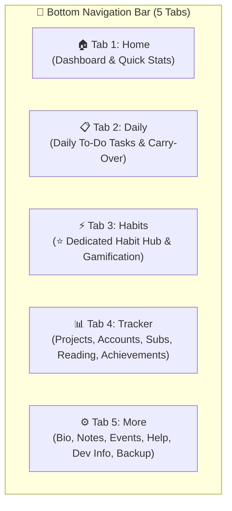
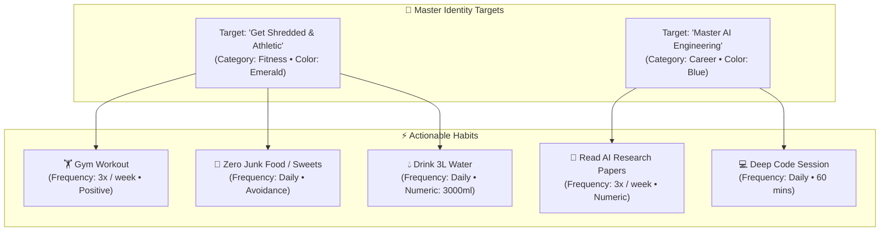
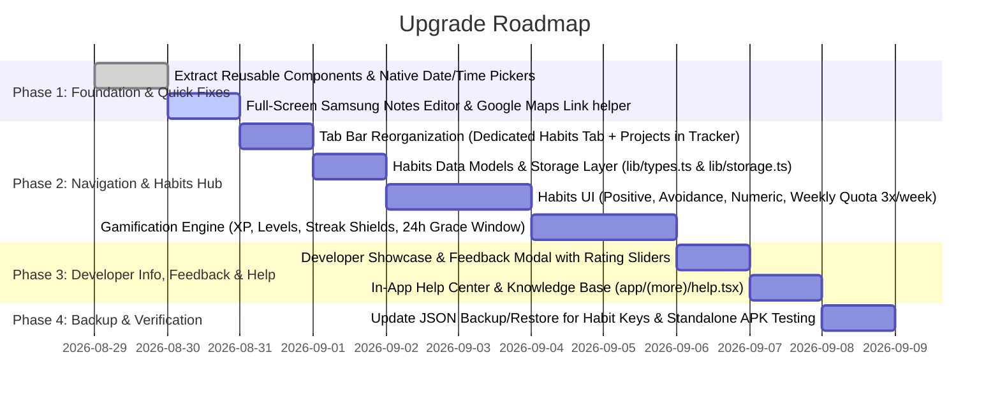

# MyLife Manager — App Upgrade Brainstorming & Architecture Blueprint

> **Project:** MyLife Manager (`com.app.mylifemanager`)  
> **Tech Stack:** React Native 0.81, Expo SDK 54 (Expo Router v6), NativeWind v4, TypeScript, AsyncStorage  
> **Scope:** Dedicated Habits Tab & Gamification, Tracker Reorganization (Projects Migration), Full-Screen Samsung Notes Editor, Developer Info & Multi-Channel Feedback with Rating Sliders, In-App Help/Manual, and Edge-Case Architecture.

---

## 1. 📱 Tab Bar Architecture: Option B (Dedicated Habits Tab)

Following user alignment, the 5-tab navigation bar will be reorganized to give **Habits & Discipline** the first-class prominence it deserves, while consolidating long-term asset management into **Tracker**:



### 1.1 Tracker Tab Sub-Modules
The `Tracker` tab (`app/(tabs)/tracker.tsx`) now houses 5 structured sub-tabs:
1. 📁 **Projects:** Software projects & Google/Cloud service-account mappings (migrated from Tab 3).
2. 🔑 **Accounts:** Login credentials, passwords, categories, clipboard copy.
3. 💰 **Subscriptions:** Active recurring expenses & monthly burn rate.
4. 📖 **Reading:** Books, papers, articles & page progress.
5. 🏆 **Achievements:** Awards, hackathon wins, milestones, and habit trophies.

### 1.2 Routing & Edge Cases for Tab Migration
* **Deep Links & Dashboard Cards:** Update `app/(tabs)/index.tsx` (Dashboard) so the "Projects" module card routes to `/(tabs)/tracker?tab=projects` and the new "Habits" card routes to `/(tabs)/habits`.
* **URL Compatibility:** Keep an alias or redirect if old project route `/projects` is triggered.
* **Storage Integrity:** Moving the UI does **not** change `@mylife_projects` in AsyncStorage, ensuring 100% data safety.

---

## 2. 🎯 Feature 1: Habit Tracking & Gamification Engine

### 2.1 Identity-Driven Target Hierarchy
Users set high-level **Master Targets** (*"Get Shredded"*, *"Master AI Engineering"*) and attach actionable habits.



---

### 2.2 How Flexible Frequencies (e.g. "Gym 3x a Week") Work Day-by-Day

A common challenge in habit apps is rigid daily schedules. MyLife Manager's frequency engine provides natural, flexible scheduling:

```
┌────────────────────────────────────────────────────────┐
│  ⚡ HABITS — WEEKLY QUOTA PROGRESSION (GYM 3X/WEEK)     │
├────────────────────────────────────────────────────────┤
│  MONDAY: (0 of 3 completed this week)                  │
│  [ ○ ] 🏋️ Gym Workout                     [ 0 / 3 ] ⚡ │
│  👉 User works out & taps checkmark:                   │
│  [ ✓ ] 🏋️ Gym Workout (Push Day)           [ 1 / 3 ] 🔥│
│                                                        │
│  TUESDAY: (1 of 3 completed - Rest Day)                │
│  [ ○ ] 🏋️ Gym Workout                     [ 1 / 3 ]    │
│  (User doesn't go to gym; no penalty, streak is safe!) │
│                                                        │
│  THURSDAY: (User goes again -> checks off)             │
│  [ ✓ ] 🏋️ Gym Workout                     [ 2 / 3 ] 🔥│
│                                                        │
│  SATURDAY: (User completes 3rd session)                │
│  [ ✓ ] 🏋️ Gym Workout                     [ 3 / 3 ] 🎉│
│  👉 Card displays: "Weekly Target Achieved! +50 XP"    │
│                                                        │
│  SUNDAY: (Bonus Day)                                   │
│  Card shows: [ 🌟 3/3 Goal Met ] + [ + Log Bonus +15XP]│
└────────────────────────────────────────────────────────┘
```

#### Weekly Quota Rules:
1. **Week Cycle:** Evaluated Monday 00:00 to Sunday 23:59.
2. **Daily State:** Each day, the card shows whether you worked out *today*, plus your cumulative progress *this week* (`X of Y`).
3. **End of Week Evaluation (Sunday Midnight):**
   - If `completedCount >= targetCount`: **Weekly Streak +1**, Streak Shield earned/kept, Big XP bonus.
   - If `completedCount < targetCount`:
     - If user has a **Streak Shield 🛡️**, the shield is auto-consumed to protect the multi-week streak, and a notification explains: *"Your Streak Shield protected your Gym streak this week!"*
     - If no shield remains: Streak resets to 0.

---

### 2.3 Editing Previous Days: Policy & Recommendation

#### ❓ The Dilemma:
If users cannot edit yesterday, falling asleep early or forgetting to log unfairly ruins their real-world streak, leading to demotivation. However, if users can freely edit 6 months in the past, gamification loses all credibility.

#### 💡 The Recommendation: **The 24-Hour "Grace Window" Rule**

```
┌────────────────────────────────────────────────────────┐
│  📅 HABIT DATE SELECTOR                                │
│  [ ◀ Yesterday (Aug 27) ]    [ ● Today (Aug 28) ]      │
└────────────────────────────────────────────────────────┘
```

1. **Today (`Day 0`):** Full real-time check-in, stepper increments, and avoidance slip logging.
2. **Yesterday (`Day -1` — The 24-Hour Grace Period):**
   - Users can toggle back to "Yesterday" with a single tap at the top of the Habits screen.
   - Allows checking off habits completed yesterday that they forgot to record before sleeping.
   - Preserves streaks naturally without feeling punitive.
3. **Past Days (`Day -2` and older):**
   - **View-Only History:** Past dates are visible on the calendar/heatmap to inspect progress, but check-in toggles are **locked**.
   - *Why this works best:* Gives psychological forgiveness for real-life accidents while preserving strict accountability.

---

### 2.4 Habit Types & Daily Interaction Models

| Habit Type | Daily Interaction Model | Example |
|---|---|---|
| **Positive Action (Build)** | **Tap to Check:** Starts unchecked `[ ○ ]`. Tapping triggers a haptic pulse, animated checkmark `[ ✓ ]`, emerald tint, and floating badge `+25 XP! 🔥`. | *Morning Meditation, Gym Workout, Read 20 Pages* |
| **Avoidance / Negative (Break)** | **Shield Status:** Starts each day in a glowing **"🛡️ Shield Active (Safe)"** state. If un-breached at midnight, it auto-awards XP & increments streak. Tapping **"Log Slip"** calmly flips the card to a reflective state (*"Slip logged. Restart fresh tomorrow!"*). | *No Sweets, No Social Media past 10 PM, Zero Alcohol* |
| **Numeric / Counter** | **Interactive Stepper:** Visual progress bar (e.g. `1,500 / 3,000 ml`). Quick-add chips (`+250ml`, `+500ml`) fill the bar. Reaching 100% triggers a completion burst. | *Drink 3,000 ml water, 10,000 steps, 45 min reading* |

---

### 2.5 Gamification: XP, Levels, Shields & Badges
* **⚡ XP Progression:** Level 1 (*Novice Initiate*) ➔ Level 15 (*Discipline Warrior*) ➔ Level 30 (*Habit Master*) ➔ Level 50 (*Titan of Focus*).
* **🔥 Streaks & Freeze Shields:** 1 free shield per week (Monday refill) protects against sickness or emergencies.
* **💯 30-Day Rolling Consistency Score:** Reflects true long-term momentum based on James Clear's "Never miss twice" rule.
* **🟩 GitHub-Style Heatmap:** Interactive matrix displaying intensity of habit execution over 90–180 days.

---

## 3. 📝 Feature 2: Full-Screen Note Editor (Samsung Notes Style)

### 3.1 The Problem with Modals for Writing
In the current app, creating/updating notes opens a half-sheet modal. When the soft keyboard opens on mobile, it covers the text input, blinding the user to what they are writing.

### 3.2 The Solution: Full-Screen Native Document Editor
Instead of a popup dialog, tapping a note or "New Note" opens a dedicated **Full-Screen Editor Screen** (`app/(more)/note-editor.tsx`) inspired by **Samsung Notes** and **Apple Notes**:

```
┌────────────────────────────────────────────────────────┐
│  ← Notes             [ Category: Work ▾ ]      [ ✓ Done│
├────────────────────────────────────────────────────────┤
│  Aug 28, 2026 • 9:15 PM  |  428 words                  │
│                                                        │
│  Project Alpha Architecture Notes                      │
│  ━━━━━━━━━━━━━━━━━━━━━━━━━━━━━━━━━━━━━━━━━━━━━━━━━━━━  │
│                                                        │
│  Key Decisions for v2.0:                               │
│  1. Migrate projects into tracker sub-tab              │
│  2. Build dedicated habits engine with XP              │
│  3. Use full-screen document view for notes            │
│                                                        │
│  The keyboard pops up below, and the document          │
│  smoothly scrolls up with zero clipping or overlay!    │
│                                                        │
│  ┌──────────────────────────────────────────────────┐  │
│  │ [Q] [W] [E] [R] [T] [Y] [U] [I] [O] [P]          │  │
│  │  [A] [S] [D] [F] [G] [H] [J] [K] [L]             │  │
│  │   [Z] [X] [C] [V] [B] [N] [M] [⌫]                │  │
│  └──────────────────────────────────────────────────┘  │
└────────────────────────────────────────────────────────┘
```

#### Key Highlights of Full-Screen Note Editor:
1. **Clean Borderless Header:** Back button `←`, category picker pill, word count / timestamp, and `✓ Done` action.
2. **Auto-Growing Title:** Large bold title field (`fontSize: 22`, font weight `700`) with subtle separator.
3. **Expansive Body:** Multi-line text input occupying 100% remaining screen height with `textAlignVertical: "top"`.
4. **Keyboard Avoidance:** Wrapped in `KeyboardAvoidingView` with `keyboardShouldPersistTaps="handled"`, ensuring smooth typing regardless of screen height or keyboard size.
5. **Auto-Save:** Saves automatically on typing or pressing back, so no thoughts are ever lost.

---

## 4. 👨‍💻 Feature 3: Developer Info & Feedback with Quality Sliders

### 4.1 Developer Profile & Multi-Channel Dispatch
Located in `app/(tabs)/more.tsx` or a sub-route:
* **Developer Card:** Sithum Fernando (Full-Stack & Mobile Software Engineer).
* **Quick Links:** LinkedIn, GitHub, Email, WhatsApp.

### 4.2 Feedback Dialog with Rating Sliders

```
┌────────────────────────────────────────────────────────┐
│  💬 Send Feedback & App Rating                         │
├────────────────────────────────────────────────────────┤
│  Feedback Category:                                    │
│  (•) 💡 Feature Request  ( ) 🐛 Bug Report  ( ) ⭐ Review│
│                                                        │
│  Rate Your Experience:                                 │
│  🎨 UI & Visual Design:       [======●===]  4/5 ⭐     │
│  ⚡ Speed & Performance:      [========●=]  5/5 ⚡     │
│  🎯 Features & Utility:       [=======●==]  4/5 🎯     │
│  ✨ Ease of Use:              [========●=]  5/5 ✨     │
│                                                        │
│  Your Comments / Suggestions:                          │
│  ┌──────────────────────────────────────────────────┐  │
│  │ "I love the habit streak shields! Would also     │  │
│  │ like a home screen widget for daily habits..."   │  │
│  └──────────────────────────────────────────────────┘  │
│                                                        │
│  [✓] Include Diagnostics (App v1.1.0 • Android • Dark) │
│                                                        │
│  Send via:                                             │
│  ┌──────────────────────────────────────────────────┐  │
│  │ [💬 Send on WhatsApp]     [✉️ Send via Email]    │  │
│  │ [📋 Copy Formatted Text]                          │  │
│  └──────────────────────────────────────────────────┘  │
└────────────────────────────────────────────────────────┘
```

#### Formatted Message Output:
```text
👋 Hi Sithum!

*MyLife Manager Feedback [💡 Feature Request]*

⭐ *Quality Ratings:*
• UI & Design: 4/5 ⭐
• Speed & Performance: 5/5 ⚡
• Features & Utility: 4/5 🎯
• Ease of Use: 5/5 ✨
• Overall Score: 4.5 / 5.0

📝 *Comments:*
"I love the habit streak shields! Would also like a home screen widget for daily habits..."

📱 _Diagnostics: App v1.1.0 | Android 14 | Dark Theme_
```

---

## 5. 📖 Feature 4: In-App User Manual & Knowledge Base

An interactive accordion guide in `app/(more)/help.tsx`:
1. **🔐 Security & PIN Lock:** How offline 6-digit PIN verification operates & changing PIN.
2. **📋 Daily Tasks & Carry-Over:** How morning transition and yesterday's report function.
3. **⚡ Habits & Weekly Quotas:** How flexible weekly goals (e.g. 3x/week), streak shields, and the 24-hour edit grace window work.
4. **📁 Projects & Service Accounts:** Mapping cloud and developer accounts to software projects.
5. **💰 Subscription Tracking:** Monthly burn rate calculations.
6. **💾 Backup & Migration:** Exporting/importing offline JSON to transfer data between devices.

---

## 6. 🛡️ Critical Edge Cases & Safeguards

| Scenario / Edge Case | Risk | Engineered Solution |
|---|---|---|
| **Multi-Day Inactivity (e.g. User absent for 2 weeks)** | Calculating streaks across missed days could cause UI freeze or infinite loops. | Mathematical date-diff calculation: `daysMissed = Math.floor((today - lastLogDate) / (1000 * 60 * 60 * 24))`. If `daysMissed > 1`, consume 1 streak shield if active, otherwise set streak to 0 in `O(1)` time. |
| **Archiving or Deleting a Habit** | Deleting a habit could orphan past XP, logs, or break level totals. | Support `archived: true`. The habit disappears from the active daily board, but historical logs and cumulative XP are retained. |
| **Timezone Changes / Midnight Clock Drift** | Phone clock skew or crossing timezones could create duplicate logs for the same date. | All habit logs are keyed by strict ISO date string `YYYY-MM-DD` generated from device local time. A unique index `habitId + date` prevents duplicate daily logs. |
| **Tab Reorganization (Projects to Tracker)** | Broken navigation routes or state loss. | Route references updated across `index.tsx`, `tracker.tsx`, and `app.config.ts`. Projects storage key `@mylife_projects` remains unchanged. |
| **Keyboard Covering Inputs in Forms** | Poor text input UX on smaller Android phones. | Replaced all modal writing surfaces with full-screen native editors and `KeyboardAvoidingView`. |
| **Date Input Formatting Errors** | User typing invalid date strings like `"2026/8/2"` or `"Aug 28"`. | Replaced manual text fields with native Visual Calendar & Clock widgets (`@react-native-community/datetimepicker`). |

---

## 7. 🧩 Reusable Component Architecture

| Component | Files to Replace | Benefits |
|---|---|---|
| `<DatePickerField>` / `<TimePickerField>` | `(add)/*`, `events.tsx`, `competitions.tsx` | Opens native Android/iOS calendar & clock dialogs; eliminates manual typing. |
| `<BottomSheetModal>` | `daily.tsx`, `more.tsx`, `venues.tsx` | Unified drag handle, backdrop blur, safe area insets. |
| `<ScreenHeader>` | `daily.tsx`, `habits.tsx`, `tracker.tsx` | Consistent `fontSize: 28` title + primary `+` action button. |
| `<CategoryPillSelector>` | `tracker.tsx`, `notes.tsx`, `habits.tsx` | Smooth horizontal pill selector with active badge indicator. |
| `<SearchBar>` | `tracker.tsx`, `notes.tsx`, `competitions.tsx` | Surface card with search icon, clear button, and debounce. |
| `<EmptyState>` | All list screens | Unified empty state with icon, title, subtitle, and action button. |
| `<LocationLinkButton>` | `venues.tsx`, `events.tsx` | One-tap button opening address directly in Google Maps. |

---

## 8. 🛠️ Implementation Roadmap



---
*Updated as part of the MyLife Manager Architecture Series.*
